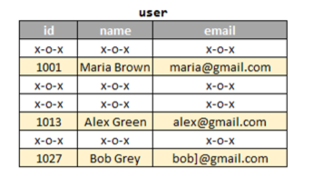
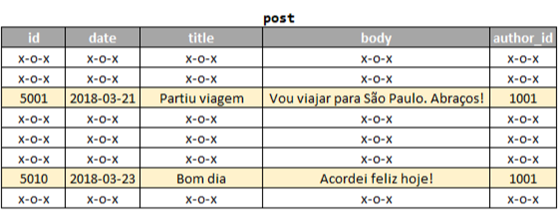
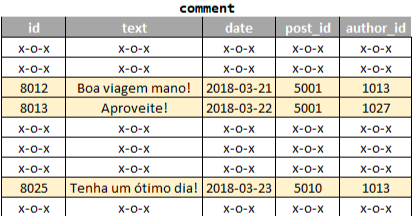
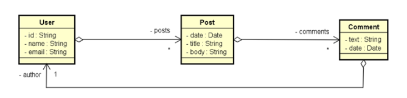
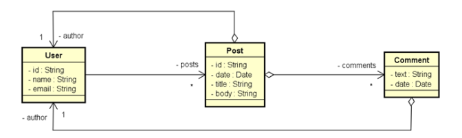

<p align="center">
  
</p>

# Objetivo

Workshop de SpringBoot com MongoDB.

# Projeto

Faremos um projeto chamado DSPosts (uma mini rede social): SpringBoot + NoSQL.

# UML


# UML em um banco de dados relacional 

## User



## Post



## Comment



# Opção 1 de agregação

Como é possível ver na imagem, usamos o diamante (símbolo de agregação).



E dizemos que o User está agregado ao Post. E o Post está agregado ao Comment.

Resumindo, agregamos todo mundo, como se o banco de dados tivesse uma única coleção em que cada elemento dessa coleção 
carrega um User agregado com os seus Posts que por sua vez estará agregado aos Comments.

Esse JSON abaixo representa um objeto (elemento dessa coleção citada acima). Logo, se formos acessar todos esses dados 
eles virão JUNTOS.

Você ainda pode observar, que dentro desse objeto possuímos uma lista de Posts, que por sua vez dentro dele, possui uma 
lista de Comments.

Cabe a você saber se isso te atende ou não, visto que quando buscarmos um User, virá TUDO dele (posts/comments).

```json
{
   	"id": "1001",
   	"name": "Maria Brown",
   	"email": "maria@gmail.com",
   	"posts": [
         	{
                	"date": "2018-03-21",
                	"title": "Partiu viagem",
                	"body": "Vou viajar para São Paulo. Abraços!",
                	"comments": [
                       	{
                              	"text": "Boa viagem mano!",
                              	"date": "2018-03-21",
                              	"author": {
                                    	"id": "1013",
                                    	"name": "Alex Green"
                              	}
                       	},
                       	{
                              	"text": "Aproveite!",
                              	"date": "2018-03-22",
                              	"author": {
                                    	"id": "1027",
                                    	"name": "Bob Grey"
                              	}
                       	}
                	]
         	},
         	{
                	"date": "2018-03-23",
                	"title": "Bom dia",
                	"body": "Acordei feliz hoje!",
                	"comments": [
                       	{
                              	"text": "Tenha um ótimo dia!",
                              	"date": "2018-03-23",
                              	"author": {
                                    	"id": "1013",
                                    	"name": "Alex Green"
                              	}
                       	}
                	]
         	}
   	]
}
```

# Opção 2 de agregação

Nessa opção, não temos nenhuma seta de agregação para o User. Ou seja, o Usuário não está agregado a nada, teremos uma 
coleção SOMENTE para o User.

Isso é útil quando queremos buscar os dados do User sem buscar outros dados associados a ele.



Podemos ver também que dentro do User temos uma lista com referência dos Posts (somente Id's).

Isso é diferente do banco SQL. Nas tabelas relacionais, não podemos ter múltiplas referências.

O post agora tem duas agregações: com User e Comments.

Veja, o objeto de posts possui agregação! (Ou seja, possui outro objeto associado a ele).

❗❗LEMBRE-SE: referência é igual etá no objeto de usuário, uma lista com ids referenciando os posts.

Além disso, dessa maneira (opção 2) os dados se repetem. A Maria Brown (author) do Post de ID 5001, ja está citada no
início do código JSON.

Essa opção é valida quando queremos buscar um Post, por exemplo, e já saber os seus comentários e autores.

```json
{
   	"id": "1001",
   	"name": "Maria Brown",
   	"email": "maria@gmail.com",
   	"posts": ["5001", "5010"]
}
{
   	"id": "5001",
   	"date": "2018-03-21",
   	"title": "Partiu viagem",
   	"body": "Vou viajar para São Paulo. Abraços!",
   	"author": {
         	"id": "1001",
         	"name": "Maria Brown"
   	}, 	
   	"comments": [
         	{
                	"text": "Boa viagem mano!",
                	"date": "2018-03-21",
                	"author": {
                       	"id": "1013",
                       	"name": "Alex Green"
                	}
         	},
         	{
                	"text": "Aproveite!",
                	"date": "2018-03-22",
                	"author": {
                       	"id": "1027",
                       	"name": "Bob Grey"
                	}
         	}
   	]
}
{
   	"id": "5010",
   	"date": "2018-03-23",
   	"title": "Bom dia",
   	"body": "Acordei feliz hoje!",
   	"author": {
         	"id": "1001",
         	"name": "Maria Brown"
   	}, 	
   	"comments": [
         	{
                	"text": "Tenha um ótimo dia!",
                	"date": "2018-03-23",
                	"author": {
                       	"id": "1013",
                       	"name": "Alex Green"
                	}
         	}
   	]
}
```

# Instalando servidor MondoDB via Docker

Instalaremos o servidor MongoDB via container docker, instanciando um container pegando imagem do MongoDB oficial no 
dockerhub.

## Instalar Docker

Se não tem wsl, vá no prompt/powershell e digite wsl --install. Depois instale o docker.

# Voltando para Docker + MongoDB

[Tags MongoDB](https://hub.docker.com/_/mongo/tags) selecionar latest (windows).

1. Abra o docker e logue.
2. Abrir powershell como admin ou usar terminal docker.
3. Comando: docker run -d -p 27017:27017 -v /data/db --name mongo1 mongo:8.0.1-noble

Depois do container estar rodando: docker exec -it mongo1 bash

## Para verificar localização de data volumes 

https://stackoverflow.com/questions/43181654/locating-data-volumes-in-docker-desktop-windows

``\\wsl.localhost\docker-desktop``

# MongoCompass

Com o MongoDB rodando no container docker, precisamos de uma ferramenta gráfica para acessar a manusear o banco de dados. 
Usaremos: mongo compass.

[Link](https://www.mongodb.com/try/download/compass).

Instale, coloque nova conexão e entra com localhost 27017.

# Prática -  Criando Projeto Spring Boot com Docker

Primeira coisa é ir em ``application.properties`` e: 

1. Definir um perfil de teste ``spring.profiles.active=test``;
2. Criar o arquivo properties para o perfil de test ``application-test.properties``;
3. No app de test, colocar a string de conexão ``spring.data.mongodb.uri=mongodb://localhost:27017/workshop_mongo``;
4. Coloque a dependência do docker;
5. Não esquecer de inserir as variáveis de sistemas (path) com o caminho docker/bin.

