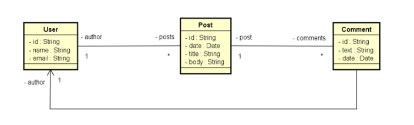
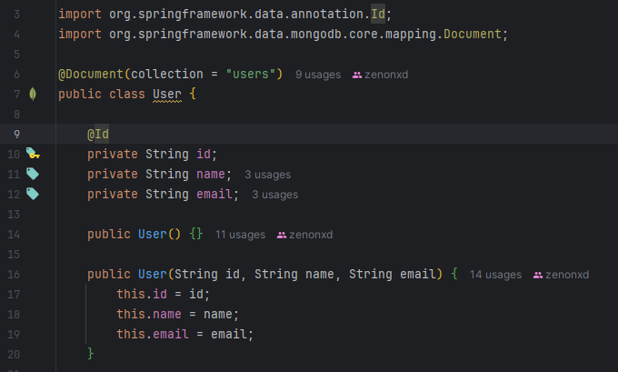

<p align="center">
  
</p>

# Objetivo

Workshop de SpringBoot com MongoDB.

# Projeto

Faremos um projeto chamado DSPosts (uma mini rede social): SpringBoot + NoSQL.

# UML



# UML em um banco de dados relacional 

## User


## Post


## Comment


# Opção 1 de agregação

Como é possível ver na imagem, usamos o diamante (símbolo de agregação).


E dizemos que o User está agregado ao Post. E o Post está agregado ao Comment.

Resumindo, agregamos todo mundo, como se o banco de dados tivesse uma única coleção em que cada elemento dessa coleção 
carrega um User agregado com os seus Posts que por sua vez estará agregado aos Comments.

Esse JSON abaixo representa um objeto (elemento dessa coleção citada acima). Logo, se formos acessar todos esses dados 
eles virão JUNTOS.

Você ainda pode observar, que dentro desse objeto possuímos uma lista de Posts, que por sua vez dentro dele, possui uma 
lista de Comments.

Cabe a você saber se isso te atende ou não, visto que quando buscarmos um User, virá TUDO dele (posts/comments).

```json
{
   	"id": "1001",
   	"name": "Maria Brown",
   	"email": "maria@gmail.com",
   	"posts": [
         	{
                	"date": "2018-03-21",
                	"title": "Partiu viagem",
                	"body": "Vou viajar para São Paulo. Abraços!",
                	"comments": [
                       	{
                              	"text": "Boa viagem mano!",
                              	"date": "2018-03-21",
                              	"author": {
                                    	"id": "1013",
                                    	"name": "Alex Green"
                              	}
                       	},
                       	{
                              	"text": "Aproveite!",
                              	"date": "2018-03-22",
                              	"author": {
                                    	"id": "1027",
                                    	"name": "Bob Grey"
                              	}
                       	}
                	]
         	},
         	{
                	"date": "2018-03-23",
                	"title": "Bom dia",
                	"body": "Acordei feliz hoje!",
                	"comments": [
                       	{
                              	"text": "Tenha um ótimo dia!",
                              	"date": "2018-03-23",
                              	"author": {
                                    	"id": "1013",
                                    	"name": "Alex Green"
                              	}
                       	}
                	]
         	}
   	]
}
```

# Opção 2 de agregação

Nessa opção, não temos nenhuma seta de agregação para o User. Ou seja, o Usuário não está agregado a nada, teremos uma 
coleção SOMENTE para o User.

Isso é útil quando queremos buscar os dados do User sem buscar outros dados associados a ele.


Podemos ver também que dentro do User temos uma lista com referência dos Posts (somente Id's).

Isso é diferente do banco SQL. Nas tabelas relacionais, não podemos ter múltiplas referências.

O post agora tem duas agregações: com User e Comments.

Veja, o objeto de posts possui agregação! (Ou seja, possui outro objeto associado a ele).

❗❗LEMBRE-SE: referência é igual etá no objeto de usuário, uma lista com ids referenciando os posts.

Além disso, dessa maneira (opção 2) os dados se repetem. A Maria Brown (author) do Post de ID 5001, ja está citada no
início do código JSON.

Essa opção é valida quando queremos buscar um Post, por exemplo, e já saber os seus comentários e autores.

```json
{
   	"id": "1001",
   	"name": "Maria Brown",
   	"email": "maria@gmail.com",
   	"posts": ["5001", "5010"]
}
{
   	"id": "5001",
   	"date": "2018-03-21",
   	"title": "Partiu viagem",
   	"body": "Vou viajar para São Paulo. Abraços!",
   	"author": {
         	"id": "1001",
         	"name": "Maria Brown"
   	}, 	
   	"comments": [
         	{
                	"text": "Boa viagem mano!",
                	"date": "2018-03-21",
                	"author": {
                       	"id": "1013",
                       	"name": "Alex Green"
                	}
         	},
         	{
                	"text": "Aproveite!",
                	"date": "2018-03-22",
                	"author": {
                       	"id": "1027",
                       	"name": "Bob Grey"
                	}
         	}
   	]
}
{
   	"id": "5010",
   	"date": "2018-03-23",
   	"title": "Bom dia",
   	"body": "Acordei feliz hoje!",
   	"author": {
         	"id": "1001",
         	"name": "Maria Brown"
   	}, 	
   	"comments": [
         	{
                	"text": "Tenha um ótimo dia!",
                	"date": "2018-03-23",
                	"author": {
                       	"id": "1013",
                       	"name": "Alex Green"
                	}
         	}
   	]
}
```

# Instalando servidor MondoDB via Docker

Instalaremos o servidor MongoDB via container docker, instanciando um container pegando imagem do MongoDB oficial no 
dockerhub.

## Instalar Docker

Se não tem wsl, vá no prompt/powershell e digite wsl --install. Depois instale o docker.

# Voltando para Docker + MongoDB

[Tags MongoDB](https://hub.docker.com/_/mongo/tags) selecionar latest (windows).

1. Abra o docker e logue.
2. Abrir powershell como admin ou usar terminal docker.
3. Comando: docker run -d -p 27017:27017 -v /data/db --name mongo1 mongo:8.0.1-noble

Resultado:


Depois do container estar rodando: docker exec -it mongo1 bash

## Para verificar localização de data volumes 

https://stackoverflow.com/questions/43181654/locating-data-volumes-in-docker-desktop-windows

``\\wsl.localhost\docker-desktop``

# MongoCompass

Com o MongoDB rodando no container docker, precisamos de uma ferramenta gráfica para acessar a manusear o banco de dados. 
Usaremos: mongo compass.

[Link](https://www.mongodb.com/try/download/compass).

Instale, coloque nova conexão e entra com localhost 27017.

# Prática -  Criando Projeto Spring Boot com Docker

[Collection Postman](https://github.com/devsuperior/nosql/blob/main/workshop-springboot2-mongo4/DSPosts.postman_collection.json)

Primeira coisa é ir em ``application.properties`` e: 

1. Definir um perfil de teste ``spring.profiles.active=test``;
2. Criar o arquivo properties para o perfil de test ``application-test.properties``;
3. No app de test, colocar a string de conexão ``spring.data.mongodb.uri=mongodb://localhost:27017/workshop_mongo``;
4. Coloque a dependência do docker;
5. Não esquecer de inserir as variáveis de sistemas (path) com o caminho docker/bin.

Ao rodar a aplicação, ele criará no Docker o container "workshop_mongo":


## Criando entidades e mapeamento

Lembrar que usaremos a [opção 2 de agregação](#opção-2-de-agregação). Logo:

- User não terá nada agregado a ele (somente ID's dos Posts);


- Post terá o comentário e também o autor do post. 


- Cada comentário também terá um autor.


- Classes auxiliares ficarão no pacote models.embedded! ❗❗

Embedded = objetos agregados a outro objeto principal (author para post)

## Inserindo User

Crie a entidade User. Diferente de quando usamos os outros bancos, ela não terá @Entity e sim @Document.

Serão anottations advindas do MongoDB.



Para que ela seja inserida corretamente no MongoDB Compass, precisamos configurar o ``compose.yaml``

## Compose

```yaml
services:
  mongodb:
    image: mongo:latest
    container_name: mongo_container
    ports:
      - "27017"
    volumes:
      - mongodb_data:/data/db

volumes:
  mongodb_data:
```

Com esse compose, ele criará um Container chamado "mongo_container", veja no docker:


Mas, para que possamos visualizar os dados inseridos no MongoDB compass, faremos o seguinte.

A gente roda o compose (service e o container criado) > dashboard e adiciona a porta. A porta a ser adicionada precisa 
ser igual a que está no docker.

Veja na imagem acima, está "49571:27017", colocaremos a primeira porta:


## Author, Comment, Post

Sabemos que o usuário não terá nenhum agregado (somente as referências para os Id's dos posts).

### Post

O Post já terá os seus atributos + o comentário e o autor do post.

Para que Posts fiquem referenciados no User conforme pode ser visto no UML, criaremos no User uma lista de posts (public),
com a anotação @DBRef(lazy = true).

Esse lazy diz para a aplicação que quando formos buscar um Usuário, não é para carregar os seus posts. 
Só carregamos os posts se chamarmos eles.

Por fim, criar o PostRepository.

Para iniciar dados, mesma coisa, ir no TestConfig.

## Data base seeding

Inserir na TestConfig.

```java
@PostConstruct
public void init() {

    //caso exista um Usuário, será deletado
    //o banco sempre será iniciado vazio
    userRepository.deleteAll();
    postRepository.deleteAll();


    User maria = new User(null, "Maria Brown", "maria@gmail.com");
    User alex = new User(null, "Alex Green", "alex@gmail.com");
    User bob = new User(null, "Bob Grey", "bob@gmail.com");

    userRepository.saveAll(Arrays.asList(maria, alex, bob));

    //veja no fim da instanciação, agregamos um author para o post
    //usando os Users acima criados
    Post post1 = new Post(null, Instant.parse("2021-02-13T11:15:01Z"), "Partiu viagem", "Vou viajar para São Paulo. Abraços!", new Author(maria));
    Post post2 = new Post(null, Instant.parse("2021-02-14T10:05:49Z"), "Bom dia", "Acordei feliz hoje!", new Author(maria));

    //mesma coisa nos comentarios, passamos um author, alocando um User instanciado
    Comment c1 = new Comment("Boa viagem mano!", Instant.parse("2021-02-13T14:30:01Z"), new Author(alex));
    Comment c2 = new Comment("Aproveite", Instant.parse("2021-02-13T15:38:05Z"), new Author(bob));
    Comment c3 = new Comment("Tenha um ótimo dia!", Instant.parse("2021-02-14T12:34:26Z"), new Author(alex));

    //entramos no Post, puxamos a lista de comentários e adicionamos como Array
    //os comments criados acima (agregando os comments ao post)
    post1.getComments().addAll(Arrays.asList(c1, c2));
    post2.getComments().addAll(Arrays.asList(c3));

    //depois de agregar tudo ao post, salvamos no banco
    postRepository.saveAll(Arrays.asList(post1, post2));

    //acessamos os posts da maria, e colocamos o post1 e 2 associados a ela
    //afinal, um User tem uma lista de Posts, correto?
    maria.getPosts().addAll(Arrays.asList(post1, post2));
    //salva tudo do usuário
    userRepository.save(maria);
}
```

Rodando o projeto, podemos ver tudo no MongoDB Compass, veja:

Posts - Repare o ID do post, ele será referenciado no Users


Users - Veja o post referenciado


## Endpoints

Com a aplicação devidamente mapeada e com seeding, começaremos os nossos endpoints.

### Users

### GET all Users


#### Controller

```java
@GetMapping
public ResponseEntity<Page<UserDTO>> findAll(Pageable pageable) {
    Page<UserDTO> list = userService.findAll(pageable);
    return ResponseEntity.ok().body(list);
}
```

#### Service

```java
public Page<UserDTO> findAll(Pageable pageable) {
    Page<User> users = userRepository.findAll(pageable);
    return users.map(UserDTO::new);
}
```

### GET User by id


#### Controller

```java
@GetMapping(value = "/{id}")
public ResponseEntity<UserDTO> findById(@PathVariable String id) {
    UserDTO obj = userService.findById(id);
    return ResponseEntity.ok().body(obj);
}
```

#### Service

```java
public UserDTO findById(String id) {
    User user = userRepository.findById(id)
            .orElseThrow(() -> new ResourceNotFound("Recurso não encontrado."));

    return new UserDTO(user);
}
```

### POST User


#### Controller

```java
@PostMapping
public ResponseEntity<UserDTO> insert(@RequestBody UserDTO userDTO) {
    userDTO = userService.insert(userDTO);
    URI uri = ServletUriComponentsBuilder.fromCurrentRequest().path("/{id}").buildAndExpand(userDTO.getId()).toUri();
    return ResponseEntity.created(uri).body(userDTO);
}
```

#### Service

```java
public UserDTO insert(UserDTO userDTO) {
    User user = new User();
    copyDtoToEntity(userDTO, user);
    //agora usar insert para o mongoDB, não save
    user = userRepository.insert(user);
    return new UserDTO(user);
}
```

### PUT User

O ID passado na requisição postman, foi um ID tirado do MongoDB compass.


#### Controller

```java
@PutMapping(value = "/{id}")
public ResponseEntity<UserDTO> update(@PathVariable String id, @RequestBody UserDTO dto) {
    dto = userService.update(id, dto);
    return ResponseEntity.ok().body(dto);
}
```

#### Service

Criamos aqui um método private dentro do service só para reaproveitar a localização de um User por id:

```java
private User getEntityById(String id) {
    Optional<User> user = userRepository.findById(id);
    return user.orElseThrow(() -> new ResourceNotFound("Objeto não encontrado."));
}
```

```java
public UserDTO update(String id, UserDTO dto) {
    try {
        User entity = getEntityById(id);
        copyDtoToEntity(dto, entity);
        entity = userRepository.save(entity);
        return new UserDTO(entity);
    } catch (EntityNotFoundException e) {
        throw new ResourceNotFound("Recurso não encontrado");
    }
}
```

### DELETE User


#### Controller

```java
@DeleteMapping(value = "/{id}")
public ResponseEntity<UserDTO> delete(@PathVariable String id) {
    userService.delete(id);
    return ResponseEntity.noContent().build();
}
```

#### Service

```java
public void delete(String id) {
    getEntityById(id);
    userRepository.deleteById(id);
}
```

### GET User posts


#### PostDTO


#### Controller

```java
@GetMapping(value = "/{id}/posts")
public ResponseEntity<List<PostDTO>> getUserPosts(@PathVariable String id) {
    List<PostDTO> obj = userService.getUsersPosts(id);
    return ResponseEntity.ok().body(obj);
}
```

#### Service

```java
public List<PostDTO> getUsersPosts(String id) {
    User user = getEntityById(id);
    return user.getPosts().stream()
            .map(PostDTO::new).toList();
}
```

## Tratamento de Exceções

Vá no pacote Controller, e crie um subpacote "exceptions".

Crie:

1. StandardError

```java
public class StandardError implements Serializable {
	private static final long serialVersionUID = 1L;

	private Long timestamp;
	private Integer status;
	private String error;
	private String message;
	private String path;
}
```

2. ResourceExceptionHandler

```java
@ControllerAdvice
public class ResourceExceptionHandler {

	@ExceptionHandler(ResourceNotFoundException.class)
	public ResponseEntity<StandardError> resourceNotFound(ResourceNotFoundException e, HttpServletRequest request) {
		
		HttpStatus status = HttpStatus.NOT_FOUND;
		
		StandardError error = new StandardError();
		error.setError("Not found");
		error.setMessage(e.getMessage());
		error.setPath(request.getRequestURI());
		error.setStatus(status.value());
		error.setTimestamp(Instant.now());
	
		return ResponseEntity.status(status).body(error);
	}
}
```

### Post

#### GET post by ID

#### Controller

```java
@GetMapping(value = "/{id}")
public PostDTO findById(@PathVariable String id) {
    return postService.findById(id);
}
```

#### Service

```java
public PostDTO findById(String id) {
    Post post = postRepository.findById(id)
            .orElseThrow(() -> new ResourceNotFound("Post not found"));
        
    return new PostDTO(post);
}

private Post getEntityById(String id) {
    Optional<Post> post = postRepository.findById(id);
    return post.orElseThrow(() -> new ResourceNotFound("Objeto não encontrado."));
}
```

#### GET post by title (query methods)

[Spring Query Methods](https://docs.spring.io/spring-data/jpa/reference/jpa/query-methods.html)

###### Controller

```java
@GetMapping("/titlesearch")
public ResponseEntity<List<PostDTO>> searchByTitle(@RequestParam("text") String text) {
    List<PostDTO> posts = postService.searchByTitle(text);
    if (posts.isEmpty()) {
        return ResponseEntity.notFound().build();
    }
    return ResponseEntity.ok(posts);
}
```

###### Service

```java
public List<PostDTO> searchByTitle(String text) {
    List<Post> posts = postRepository.findByTitleContaingIgnoreCase(text);

    return posts.stream().map(PostDTO::new).toList();
}
```

###### Repository

```java
@Repository
public interface PostRepository extends MongoRepository<Post, String> {
    List<Post> findByTitleContaingIgnoreCase(String text);
}
```

#### GET post by title (query operators)

[MongoDB Queries](https://www.mongodb.com/pt-br/docs/manual/reference/operator/query/regex)

Inicialmente, a query seria assim:

```
{ <field>: { $regex: /pattern/, $options: '<options>' } }
```

```java
@Query("{ 'title': { $regex: ?0, $options: 'i' } }")
List<Post> searchTitle(String text);
```

Como pode notar, o field é o campo que estamos buscando.

O pattern funciona da seguinte forma: colocamos uma "?" e após, a numeração do parâmetro. Se por ventura o campo text
fosse o segundo parametro seria "?1".

#### GET post full search

Essa full search possui um start e end date, veja:


Nosso Post possui um instant, correto? Portanto, esse moment precisa estar **entre o start e end da requisição**.

Como é full search, o text deve estar contido ou no **title, body ou nos comments**.

Inicialmente a consulta no @Quey começará com uma lista de condições "end".

O $and tem a seguinte sintaxe:

{ $and: [ { <expression1> }, { <expression2> } , ... , { <expressionN> } ] }

Cada expressão ali dentro será uma condicional.

```java
List<Post> fullSearch(String text, Instant startMoment, Instant endMoment);
```

As duas primeiras condicionais serão o startMoment e endMoment, ou seja, "?1 e ?2".

O startMoment (?1), terá o operador $gte. Ele seleciona os documentos nos quais o valor do campo especificado é maior 
ou igual a (ou seja, >=).

Sintaxe: ``{ field: { $gte: value } }``

O value é = ?1 (parâmetro do método no Repository).

O endMoment (?2), terá o operador $lte. Ele seleciona os documentos em que o valor de field é menor ou igual ao value 
especificado (ou seja, <=).

Sintaxe: ``{ field: { $lte: value } }``

O value é = ?2 (parâmetro do método no Repository).

O terceiro e ultimo parâmetro a ser inserido dentro da condicional $and será os campos de text. Dessa vez, ele não será
um search somente do title. Ele buscará no title, post e comments. Assim sendo, serão 03 fields, onde usaremos $or.

``"{ 'title': { $regex: ?0, $options: 'i' } },
"{ 'body': { $regex: ?0, $options: 'i' } }, 
"{ 'comments.text': { $regex: ?0, $options: 'i' } } 
``

##### Repository

```java
    @Query("{ $and: [ " +
            "{ 'moment': { $gte: ?1} }, " +
            "{ 'moment': { $lte: ?2}}," +
            "{ $or: [" +
            "{ 'title': { $regex: ?0, $options: 'i' } }, " +
            "{ 'body': { $regex: ?0, $options: 'i' } }, " +
            "{ 'comments.text': { $regex: ?0, $options: 'i' } } " +
            "]} " +
            "]}")
    List<Post> fullSearch(String text, Instant startMoment, Instant endMoment);
```

##### Service

```java
public List<PostDTO> fullSearch(String text, String start, String end) {
    //esse epochmilli garante que se o usuário não passar o início,
    // ele pegue a data de 1970 (menor valor possível)
    Instant startMoment = convertMoment(start, Instant.ofEpochMilli(0L));

    //Caso o usuário não passe nada, será o instant de agora.
    //ou seja: com certeza não tem nenhum post da hora atual
    Instant endMoment = convertMoment(end, Instant.now());

    List<Post> posts = postRepository.fullSearch(text, startMoment, endMoment);

    return posts.stream().map(PostDTO::new).toList();
}

private Instant convertMoment(String originalString, Instant alternative) {
    try {
        return Instant.parse(originalString);
    }
    catch (DateTimeParseException e) {
        return alternative;
    }
}
```

##### Controller

```java
@GetMapping("/fullSearch")
public ResponseEntity<List<PostDTO>> fullSearch(
        @RequestParam("text") String text,
        @RequestParam("start") String start,
        @RequestParam("end") String end) {

    List<PostDTO> posts = postService.fullSearch(text, start, end);
    if (posts.isEmpty()) {
        return ResponseEntity.notFound().build();
    }
    return ResponseEntity.ok(posts);
}
```

